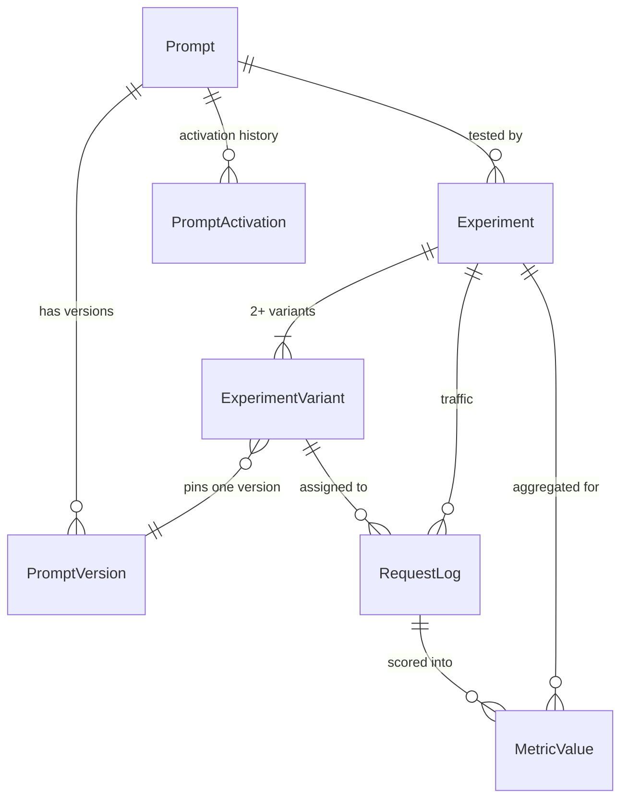
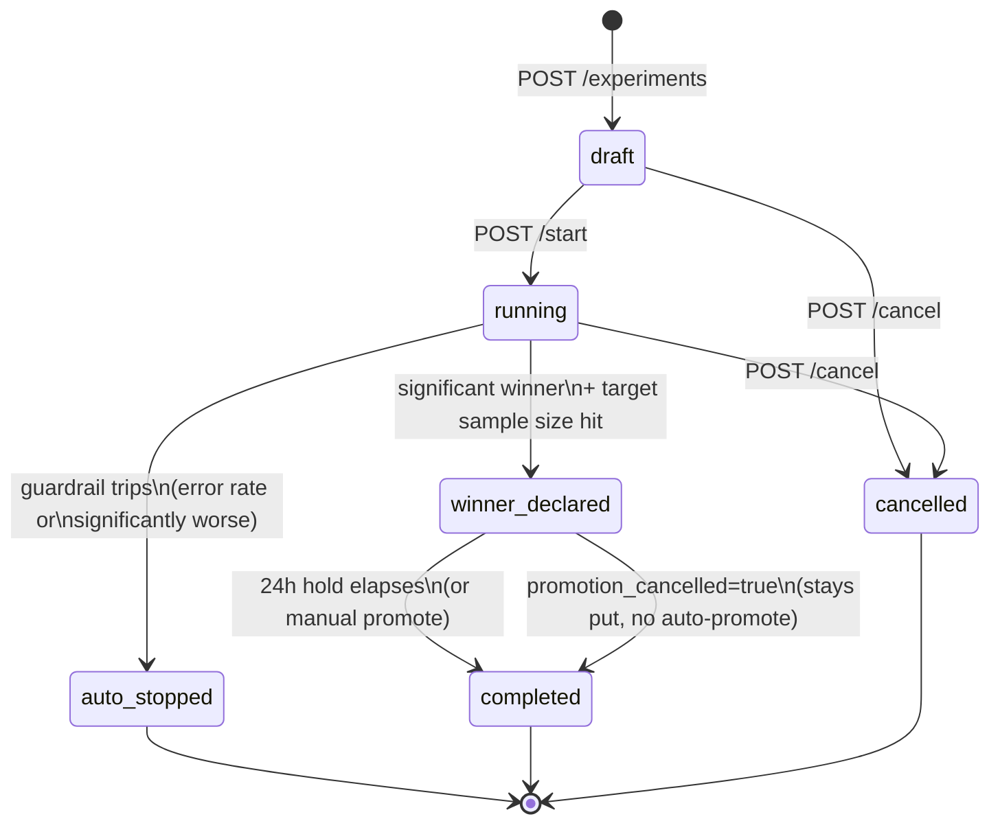
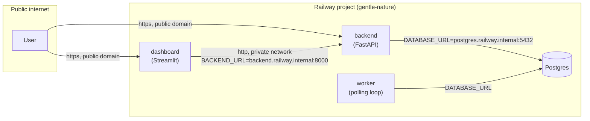

# Prompt Versioning & A/B Testing Platform

A platform that treats prompts as versioned artifacts (like code), lets teams deploy multiple prompt
variants simultaneously, splits traffic between them, measures performance across custom metrics, and
declares statistically significant winners — bringing the rigor of feature flagging and experimentation
to LLM-powered features.

> "I built a prompt experimentation platform that brings feature-flagging rigor to LLM development.
> Teams can test prompt changes against live traffic and get statistically significant results instead
> of guessing." Positioned as infrastructure, not a toy.

## Tech stack

| Component | Tool / Library |
|---|---|
| Language | Python 3.11+ |
| LLM Provider | OpenAI / Anthropic, with a built-in offline mock provider |
| Storage | PostgreSQL (SQLite supported for tests) |
| Statistics | scipy.stats (Welch's t-test, Mann-Whitney U) |
| API | FastAPI |
| Dashboard | Streamlit |
| Async metrics | standalone polling worker |
| Containerization | Docker + docker-compose |

## Live demo

- Dashboard: https://dashboard-production-ab8c.up.railway.app
- API: https://prompt-versioning-and-a-b-testing-platform-production.up.railway.app (docs at `/docs`)

Deployed on Railway as four independent services (Postgres, FastAPI backend, worker, Streamlit
dashboard) — see [Deployment architecture](#deployment-architecture) below for how they're wired
together. The live instance is seeded with the same customer-support-classifier experiment described
in [Quickstart](#quickstart).

## Quickstart

```bash
cp .env.example .env   # optional: add OPENAI_API_KEY / ANTHROPIC_API_KEY, or leave blank for the mock provider
docker compose up --build
```

- API: http://localhost:8001 (docs at `/docs`)
- Dashboard: http://localhost:8501
- Postgres: localhost:5433 (user/pass/db: `ppat`)

(Host ports are remapped from the defaults 8000/5432 to 8001/5433 to avoid clashing with other local
projects; the containers still talk to each other internally on 8000/5432.)

Seed the demo scenario (a customer-support email classifier with three prompt variants — zero-shot,
few-shot, chain-of-thought — run as a live experiment over 500+ synthetic requests):

```bash
docker compose --profile seed run --rm seed
```

Then open the dashboard's **Experiments** page and watch the experiment converge to a winner as the
`worker` service scores metrics and re-checks significance on its polling loop. No API keys are
required — the seed script and mock LLM provider run entirely offline.

## Running tests

```bash
python -m venv .venv && source .venv/bin/activate
pip install -r backend/requirements.txt pytest
pytest tests/
```

## Architecture

```
backend/app/
  models.py            SQLAlchemy schema: prompts, versions, activations, experiments,
                        variants, assignments, request logs, metric values, notifications, audit log
  routers/prompts.py    Prompt registry: create/list prompts & versions, diff, activate/rollback
  routers/experiments.py Experiment lifecycle: create/start/cancel/promote, results
  routers/completions.py POST /v1/completions — the serving endpoint (traffic split + LLM call + logging)
  routers/compare.py    Side-by-side version comparison tool
  routers/audit.py      Audit log + notifications feed
  services/traffic_splitter.py  Consistent hashing so a user always sees the same variant
  services/templates.py Template variable extraction/rendering + validation
  services/llm_provider.py  OpenAI / Anthropic / mock provider abstraction
  services/stats_engine.py  t-test, Mann-Whitney U, CI, minimum detectable effect
  services/results_engine.py  Aggregates metric values into per-variant stats + comparisons
  services/guardrails.py   Auto-stop on error-rate/perf regressions; winner declaration + auto-promotion
  metrics/               Pluggable metric registry (latency, tokens, cost, error rate, task accuracy,
                          quality score) — register your own with @register_metric
worker/worker.py         Polls for unscored requests, runs metric collectors, guardrails, and the
                          winner/auto-promotion lifecycle — kept off the request-serving path
dashboard/                Streamlit app: prompt registry UI, experiment creation/monitoring, compare
                          tool, audit log
seed/seed_demo.py         Seeds the demo scenario end-to-end
```

## How it works (technical deep dive)

### Data model

Every experiment ties back to a `Prompt`, which owns an immutable, ordered chain of `PromptVersion`
rows. Nothing is ever mutated or deleted — a "rollback" is just flipping `Prompt.active_version_id`
to point at an older version and writing a new `PromptActivation` audit row. An `Experiment` owns 2+
`ExperimentVariant` rows, each pinned to one `PromptVersion`; every served request produces one
`RequestLog` row (optionally linked to a variant, if an experiment was running) and, once scored, one
`MetricValue` row per registered metric.



### Traffic splitting: consistent hashing, not random assignment

`POST /v1/completions` never flips a coin per request. `traffic_splitter.py` hashes
`md5(f"{experiment_id}:{user_key}")` into a bucket in `[0, 10_000)`, then maps that bucket onto
cumulative variant-percentage ranges (variants sorted by ID for a stable mapping regardless of the
order they're passed in). The same `user_key` always lands in the same bucket for a given experiment,
so a user is deterministically pinned to one variant for the life of the experiment — critical for a
fair test, since a user bouncing between variants would contaminate the comparison. Different
experiments hash independently, so a user isn't systematically biased toward "variant A" across
unrelated tests.

### Statistical engine

For each non-control variant, `stats_engine.py` runs **two** tests against the control's samples for
the primary metric:

- **Welch's t-test** (`scipy.stats.ttest_ind(..., equal_var=False)`) — doesn't assume equal variance
  between variants, which matters because a slower/costlier variant (e.g. chain-of-thought) often has
  different variance than a cheap zero-shot baseline.
- **Mann-Whitney U** — a non-parametric cross-check that doesn't assume the metric is normally
  distributed (accuracy is binary 0/1 per request, so it isn't).

Both p-values are reported; the t-test drives the `significant` flag. Alongside that: a 95%-style
confidence interval on the *difference* in means (`diff ± z·SE`), and the **minimum detectable
effect** — given the current sample size, what's the smallest true difference the test could
reliably detect at the configured power (80%)? This tells you whether "no significant difference yet"
means "they're equal" or "you don't have enough data to know."

`favors_variant` respects each metric's registered direction (`higher_is_better` in
`metrics/registry.py`) — task accuracy needs to go up to win; latency and cost need to go down.

### Experiment lifecycle



The **worker** (a separate always-on process, not the request-serving path) drives every transition
except the first two, on a 15-second poll:

1. **Metric scoring** — for every `RequestLog` not yet scored, run each registered metric collector
   and write `MetricValue` rows. This is where a slow LLM-as-judge call would happen, decoupled from
   the user-facing latency of `/v1/completions`.
2. **Guardrails** (`guardrails.py`) — for `running` experiments: if any variant's error rate exceeds
   10% (needs ≥20 requests to avoid noise on tiny samples) or a variant is *significantly worse* than
   control (needs ≥30 requests), the experiment is force-stopped and the owner is notified.
3. **Winner declaration** — once `total_samples >= target_sample_size` and at least one variant beats
   control significantly, the winner is the one with the **largest effect size** among the
   significant winners (not just the first one found in variant order — an early but mediocre winner
   shouldn't shadow a much stronger variant tested alongside it). A 24-hour `promotion_hold_until` is
   set.
4. **Auto-promotion** — once the hold period elapses (and nobody cancelled it), the winning version
   becomes the prompt's `active_version_id`, a `PromptActivation` audit row is written, and the
   experiment moves to `completed`.

### Async metrics, on purpose

The serving endpoint (`POST /v1/completions`) does the minimum needed to respond fast: resolve the
version, render the template, call the LLM, write one `RequestLog` row, return. It does **not** score
metrics inline. Scoring (especially a real LLM-as-judge call in a production deployment) runs entirely
in the worker's poll loop, so a slow metric collector can never add latency to a user-facing request.

### Deployment architecture

The live demo runs on Railway as four independently-deployed services inside one project, plus a
managed Postgres:



Only the dashboard and backend get public Railway domains; the worker has no HTTP server (it's a bare
polling loop) and Postgres is reachable only over Railway's private network. `backend` and `dashboard`
each build from their own self-contained `Dockerfile` (Railway's builder is pointed at that
subdirectory as the build root); `worker` is the odd one out — its `Dockerfile` needs the **repo
root** as build context so it can `COPY backend/app`, which is forced via the `RAILWAY_DOCKERFILE_PATH=worker/Dockerfile`
service variable rather than Railway's directory-based auto-detection.

## Build status

This tracks the phases from the original build guide, so it's easy to see what's done.

### Phase 1 — Prompt Registry
- [x] Versioning schema (id, auto-incrementing version, system prompt, few-shot examples, model
      params, commit message, timestamp) in PostgreSQL
- [x] Registry API: create prompt, create version, list versions, get version, diff endpoint
- [x] Rollback support: any version can be marked active; every activation/deactivation is
      audit-logged with actor + reason
- [x] Template variables (`{{var}}`) — the template is versioned, not the filled prompt; missing
      variables are rejected at serve time (422)

### Phase 2 — Experiment Engine
- [x] Experiment schema: name, prompt, variants, traffic split, primary metric, target sample size,
      status
- [x] Traffic splitter: consistent hashing on `user_key` so the same user always gets the same variant
- [x] Serving endpoint `POST /v1/completions`: resolves active version or experiment variant, fills
      the template, calls the LLM, logs request/response + assignment, returns the response
- [x] Guardrails: auto-stop on error rate > threshold (default 10%) or on a variant performing
      significantly worse than control on the primary metric; owner notified via the notifications feed

### Phase 3 — Metrics & Analysis
- [x] Pluggable metric framework (`@register_metric`); built-ins: latency, token usage, cost, error
      rate; custom: task accuracy / quality score (LLM-as-judge-style, swappable), computed
      asynchronously by the worker
- [x] Statistical significance testing: mean/variance per variant, Welch's t-test + Mann-Whitney U,
      p-value, confidence interval on the difference, minimum detectable effect at current sample size
- [x] Results dashboard: bar chart with error bars, sample-size progress, per-variant table,
      comparison table, winner/no-winner/inconclusive status
- [x] Automated winner declaration at the configured confidence level (default 95%), with a 24h hold
      before auto-promotion (cancellable from the dashboard)

### Phase 4 — Management Interface
- [x] Experiment management UI (Streamlit): create experiments from the registry, configure traffic
      splits/metrics, monitor running experiments, view results, promote winners with one click
- [x] Prompt comparison tool: pick two versions, send the same test inputs, compare outputs +
      predicted labels + latency side by side
- [x] Audit log UI: every prompt/version/experiment/activation/promotion action, filterable by action

### Phase 5 — Integration and Testing
- [x] Demo scenario: customer support email classifier, 3 variants (zero-shot / few-shot /
      chain-of-thought), 540 synthetic requests, converges to a winner via the mock provider's
      strategy-dependent accuracy simulation
- [x] docker-compose: PostgreSQL, FastAPI backend, Streamlit dashboard, worker, seed job (profile)
- [x] Integration tests: versioning + rollback, traffic-split consistency, metric collection accuracy,
      significance correctness (known-distribution tests), auto-stop on error-rate spikes

### Phase 6 — Polish for Portfolio
- [ ] Recorded demo walkthrough (record locally — script is under `seed/seed_demo.py` for a live run)
- [x] Narrative write-up (top of this README)

## API reference (quick)

- `POST /prompts` / `GET /prompts` / `GET /prompts/{id}`
- `POST /prompts/{id}/versions` / `GET /prompts/{id}/versions` / `GET /prompts/{id}/versions/{v}`
- `GET /prompts/{id}/diff/{v1}/{v2}`
- `POST /prompts/{id}/versions/{v}/activate` (rollback is just activating an older version)
- `GET /prompts/{id}/activations`
- `POST /experiments` / `GET /experiments` / `GET /experiments/{id}`
- `POST /experiments/{id}/start` / `.../cancel` / `.../promote` / `.../cancel-promotion`
- `GET /experiments/{id}/results`
- `POST /v1/completions` — the serving endpoint
- `POST /compare` — side-by-side version comparison
- `GET /audit-log`, `GET /notifications`
